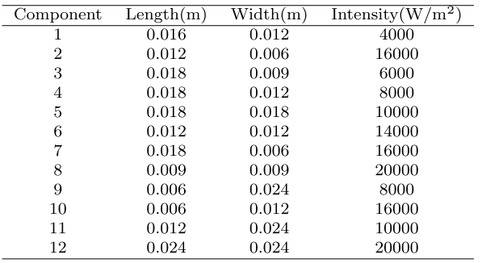

# 数据生成

```
SeqLS 方法介绍：
代码实现逻辑：
1.
```

需求：按照下面的要求生成一个python的class的代码，生成时注意变量名称和代码格式的规范性，可以多加注释描述也方便后续更新：

1. 这个类描述的对象是一个二维的卫星元件布局，布局的范围为一定尺寸的矩形，其中分布有多个元器件，元器件的造型为矩形或圆形；在此假设设备内仅发生热传导，不考虑热对流与热辐射
2. 这个类具有下面的几个函数：1）构造函数；2）增加元件的函数；3）设置边界条件的函数；4）判断元件排布是否重叠的函数；5）基于所有信息输出yaml记录文件的函数；6）输出一个方便后续fenicsx求解的数据格式的函数；7）输出可定义分辨率的有向距离函数几何表达用于深度学习训练；
3. 构造函数的输入为：布局整体尺寸，材料热导率，网格分辨率；
4. 增加元件函数可以指定元件的尺寸、坐标、功率等，也可以定义部分，其他进行随机生成；
5. 也有一些基于文件的预置的组件参数编号。（什么文件呢）
6. 边界条件包括Dirichlet条件（温度T0），和Neumann条件（绝热无热流）。

【这里就有一个问题，类的生成的，那么产生随机分布的函数写在类里吗？那么判断分布合理有无重叠的函数写在类里吗？】

现在要在卫星二维布局类的基础上完成一个数据集生成的类：
这里分为几种情况的数据集生成方式：

1. 固定元器件类似的排布生成，元器件的尺寸和功率都是固定的，就是改排布方案生成一个数据集；
2. 每个元器件的尺寸，功率，位置都是独立的分布生成【具体的非重叠排布算法】
3. 类里面需要可以定义每一个变量的分布，均匀分布或者高斯分布，有些变量间可能还需要采用联合分布；
4. 需要有yaml文件来记录一下整个数据集生成的情况，数据集规模是多大，每个变量是怎么分布的，然后生成的时间是什么时候。
5. 需要有文件管理，生成后的每个layout的yaml文件+分布图+温度场结果npy都放在一个文件夹里，然后所有的文件夹并行排列；
6. 需要有数据集整合的函数，所有都计算好后都整理到一个.mat或h5py的文件里方便后续训练调用。

## 细节

布局容器建模为0.1m× 0.1m的正方形区域。



布置容器的尺寸为0.1m × 0.1m，其边长用L = 0.1m表示。为了简化问题，但不失一般性，组件的放置角度保持固定，只允许在我们的数据集中平移。版图域被划分为200×200的网格，元件也在该网格系统中离散化。元件可以移动的最小距离是L的1/200，L是一个单元的边长。因此，即使元件只能一个单元一个单元地平移，它也可以被看作是一个连续的布局问题。在HSL-TFP公式化之后，作为输入的布局方案被表示为200×200图像矩阵，其中被组件占用的单元的值被设置为它们的强度。

### 布局方法

在布局问题中，一个必须严格满足的基本几何约束是不重叠约束。该约束要求不同组件之间不重叠，并且组件和布局容器之间不突出。只有满足非重叠约束的布局方案才能被定义为可行方案。这意味着几何上可行的布局样本可以被视为有效样本。因此，该布局抽样问题是一个约束抽样问题。在实现随机抽样方法时，主要有两种处理约束的方法。一种是被动处理非重叠约束。具体地说，可接受-拒绝抽样方法可应用于该问题。首先，我们可以在不考虑非重叠约束的情况下随机生成布局样本。然后判断所产生的布局样本是否满足该限制。如果是，则此示例有效，可以保存。否则，它将被丢弃。然而，以我们的案例研究为例，实验结果表明，在重复无约束布局采样过程30000次之后，只能获得很少的有效样本。这意味着，对无效布局方案进行采样的概率要比对有效布局方案进行采样的概率高得多。结果表明，当容器中的组分空间密度较高时，取舍取样法的效率很低。因此，为了有效地收集大量有效样本，我们必须求助于另一种方法，即主动地将非重叠约束与布局采样过程结合。同时，所提出的抽样方法应满足在可行布局空间内抽样的随机性，以保证任意一种可行布局方案都能通过抽样方法得到。基于以上两点考虑，提出了两种随机版图抽样方法：序列版图抽样（SeqLS）方法和吉布斯版图抽样（GibLS）方法，以高效、随机地生成有效的版图样本。

#### 顺序布局抽样（SeqLS）方法

SeqLS方法的主要思想是在布局域中逐个添加元件，并将每个元件随机放置在其当前可行布局区域内。一个元件的可行布局区域被定义为所有可用布局位置的并集，其中在放置该元件之后，不存在与其他元件和布局容器的重叠。应该注意的是，一个组件的可行布局区域不仅依赖于布局容器，还依赖于已放置在此之前的组件。因此，可行布局区域每次都不同。此外，可行布局区域应该是多个离散的可行布局空间的并集，这是由于满足了与其他部件的不重叠约束而产生的。因此，很难用统一的方法直接描述可变的可行布局区域，更不用说实现随机布局抽样。为了减轻这一困难，我们建议首先离散的布局域的网格系统的目的近似表示复杂的二维可行的布局区域与有限数量的位置点。这种近似是合理的，部分原因是布局方案在最终被馈送到预测模型中时被处理为图像矩阵。另一个原因是，具有足够密度的网格可以保证描述精度，保持与有限元法相同的思想。每个网格坐标可以被视为放置元件的一个可用位置。然后，我们建议构造一个组件的虚拟能量矩阵（VEM），以指示组件所占的位置，这是表示为VEMi。VEM的元素对应于网格节点，因此VEM保持与网格节点的数量相同的大小。当相应的网格节点被组件覆盖时，VEM中元素的值设置为1，否则为0。布局容器的VEM（由VEM0表示）被定义为零值矩阵。此外，还定义了扩展VEM（eVEM）来描述两个组件之间的相对位置关系，表示为eVEMij。基于已放置在布局域中的一个元件i的VEM，当对应的网格点被另一个元件j占据时，如果存在重叠，则eVEM中的元素的值将被设置为1。通过这种定义，它们的值为0的位置表示可以满足元件i和元件j之间的不重叠约束的可行布局区域
